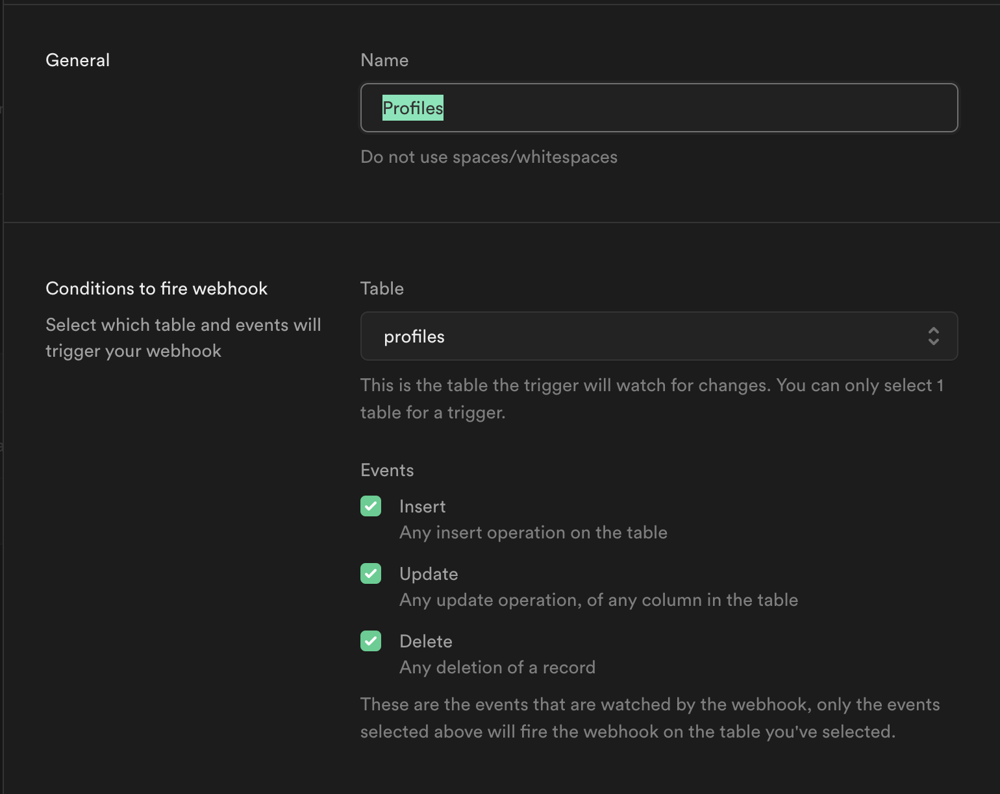
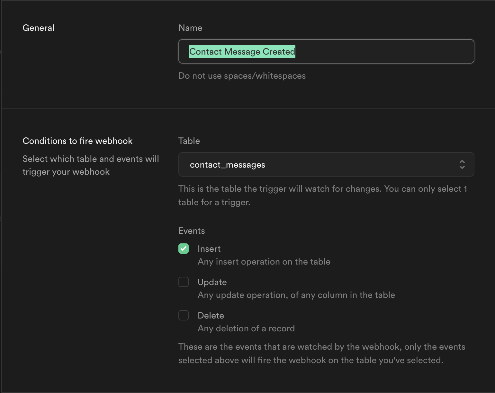
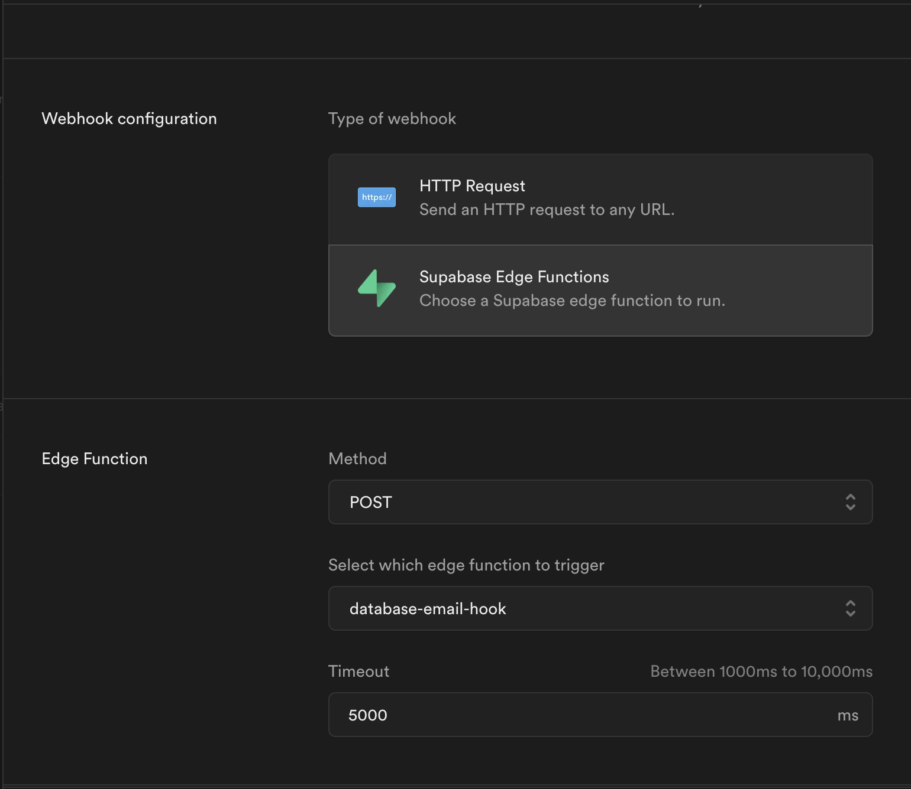
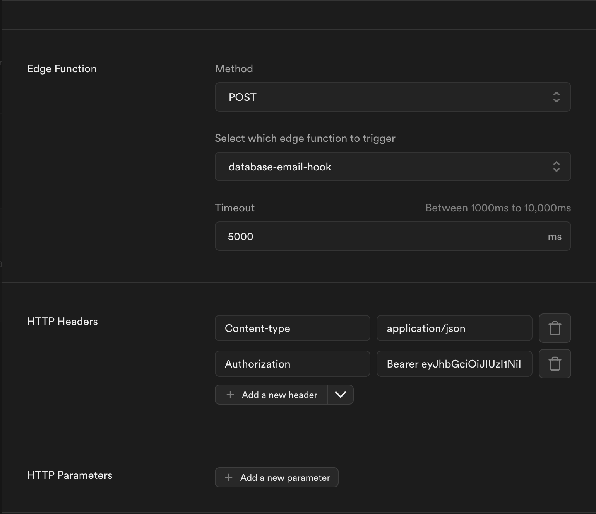

# Supabase Database Email Hook

This Supabase Edge Function listens for database webhook events and sends corresponding emails using SMTP/Resend. It ensures users receive relevant notifications for actions like profile updated, message received ...etc

## Features

- Enforce JWT verification.
- Sends emails based on database event types (`insert`, `update`, `delete`).
- Uses React Email templates for email rendering.
- Supports both HTML and plain text emails.
- Logs the email sending process for debugging.

## Setup

After running the supabase migrations you have to go to your project dashboard and enable webhooks (under integration on side-nav menu) [https://supabase.com/dashboard/project/**Your-Project-Reference**/integrations/webhooks/overview](https://supabase.com/dashboard/project/integrations/webhooks/overview)

And don't forget to add the Authorization header with your supabase service key (secret) as we enforce JWT verification.

<div style="display: grid; grid-template-columns: repeat(auto-fill, minmax(400px, 1fr)); gap: 10px;">
  
  
  
  
</div>

## Deployment

Deploy the function to your Supabase Edge Functions:

```sh
pnpm deploy:database-email-hook

or

supabase functions deploy auth-email-hook --import-map ./import-map.json
```


This function is triggered when Supabase emits an authentication-related event. It expects a `POST` request containing a verified webhook payload.

### Expected Webhook Payload

```ts
{
  "type": "INSERT" | "UPDATE" | "DELETE", 
  "table": "profiles" | "contact_message",
  "schema": "public",
  "record": {...} | null,
  "old_record": {...} | null
}
```

### Handling Different Database Events

The function processes different database event:

- **INSERT** → Sends a welcome email.
- **UPDATE** → Sends a changes applied email.
- **DELETE** → Sends a deletion email.

## Response

The function returns a JSON response indicating success:

```json
{
  "success": true
}
```

If an error occurs, it returns:

```json
{
  "error": {
    "http_code": 401,
    "message": "Error message here"
  }
}
```

## Logs

Logs will show webhook verification, email sending attempts, and their success or failure status.
